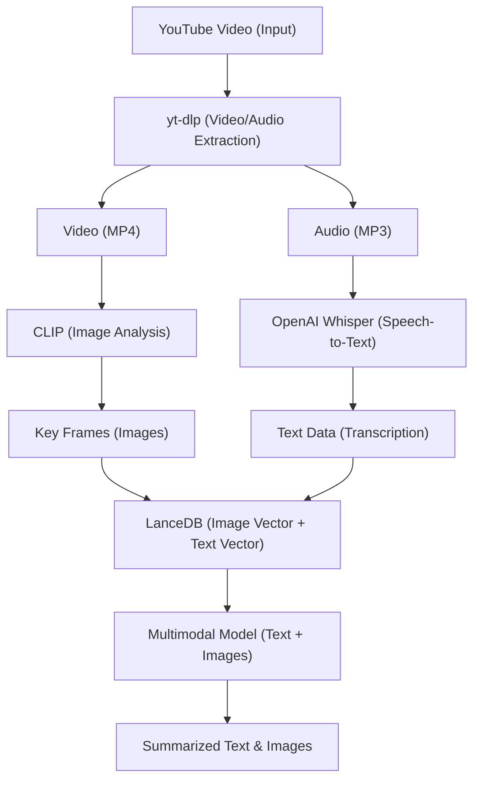

# DS-Singapore-Flat-Resale-price

<div align="center">
  <!-- Backend -->
  
  
  
  
  
  
	
  <h3>Your Singapore Flat Resale price 🚀</h3>

  <p align="center">
    <b> LanceDB Retriever | OpenAI-Whisper | Clip | Gemini MultiModal  </b>
  </p>
</div>

# Overview
The DS-Singapore-Flat-Resale-Price project is designed to predict the resale price of flats in Singapore using a regression model. The project employs a combination of machine learning, data visualization, and model management tools to predict flat prices based on various features such as flat size, location, age, and amenities. The main goal is to predict flat resale prices accurately and create an interactive environment where users can input different flat characteristics and get predictions in real-time.

# Motivation
The DS-Singapore-Flat-Resale-Price project is motivated by the growing need to predict property prices accurately in a dynamic real estate market, specifically the resale market of public flats in Singapore. several key motivations behind the project like Real Estate Market Uncertainty, Demand for Data-Driven Insights in Real Estate, 
Singapore's Unique Housing Market.

## key Features & Explanation
  1. Regression Model (XGBoost):
       - The core of the project is based on XGBoost, a powerful and widely used machine learning algorithm. XGBoost is a type of gradient boosting method that works well for regression tasks, especially when dealing with complex and large datasets.
       - The model will be trained using various features like:
          - flat_type
          - block
          - storey_range
          - floor_area_sqm
          - flat_model
          - flat_year
          - flat_month
          - remaining_lease
          - lease_commence_date
       - The model will predict the resale price of the flat based on these inputs.
## Architecture




## Project Structure
```
Youtube-Video-Summarization/
├── backend/
|  ├── src/
|  |   ├── audio_path/
|  │   ├── documents/                           
|  │   │   ├── image.png                     
|  │   │   ├── audio_text.txt             
|  |   |── lancedb/
|  │   │   ├── image_collections.lance/
|  │   │   ├── text_collections.lance/
|  |   |── tokenizer_path/         
|  |   ├── video_path/
|  |   |── whisper_model_path/
|  │   ├── request_validate.py          
|  |   ├── video_extract.py
|  │────── .env # If you want
|  │────── pyproject.toml # create virtual env using poetry
|  │────── main.py # Main entry point
|  ├── pyproject.toml
|  ├── ...
```

## Setup Instructions

### Backend Setup

1. Clone the repository
   ```bash
   git clone https://github.com/naveenkrishnan840/Youtube-Video-Summarization.git
   cd Youtube-Video-Summarization
   cd backend
   ```

2. Install Poetry (if not already installed)

   Mac/Linux:
   ```bash
   curl -sSL https://install.python-poetry.org | python3 -
   ```
   Windows:
   ```bash
   (Invoke-WebRequest -Uri https://install.python-poetry.org -UseBasicParsing).Content | python -
   ```

3. Set Python version for Poetry
   ```bash
   poetry env use python3.12
   ```

4. Activate the Poetry shell:
   For Unix/Linux/MacOS:
   ```bash
   poetry shell
   # or manually
   source $(poetry env info --path)/bin/activate
   ```
   For Windows:
   ```bash
   poetry shell
   # or manually
   & (poetry env info --path)\Scripts\activate
   ```

5. Install dependencies using Poetry:
   ```bash
   poetry install
   ```

6. Set up environment variables in `.env`:
   ```bash
    DOCUMENTS_PATH="your docs path"
    AUDIO_PATH="your audio path"
    IMAGE_FORMAT=frame%04d.png
    AUDIO_FORMAT=output_audio.mp3
    VIDEO_PATH="your video path"
    AUDIO_TEXT_FORMAT=audio_text.txt
    OUTPUT_AUDIO_PATH=output_text.txt
    GOOGLE_API_KEY="you api here"
    LANCEDB_PATH="your DB path"
   ```

7. Run the backend:

   Make sure you are in the backend folder

    ```bash
    uvicorn app.main:app --reload --port 8000 
    ```

   For Windows User:

    ```bash
    uvicorn app.main:app --port 8000
    ```

8. Access the API at `http://localhost:8000`

### Frontend Setup

1. Open a new terminal and make sure you are in the WebRover folder:
   ```bash
   cd frontend
   ```

2. Install dependencies:
   ```bash
   npm install
   ```

3. Run the frontend:
   ```bash
   npm run dev
   ```

4. Access the frontend at `http://localhost:3000`

For mac users: 

Try running http://localhost:3000 on Safari browser. 

## License

This project is licensed under the MIT License - see the [LICENSE](LICENSE) file for details.

---

Made with ❤️ by [@naveenkrishnan840](https://github.com/naveenkrishnan840)
